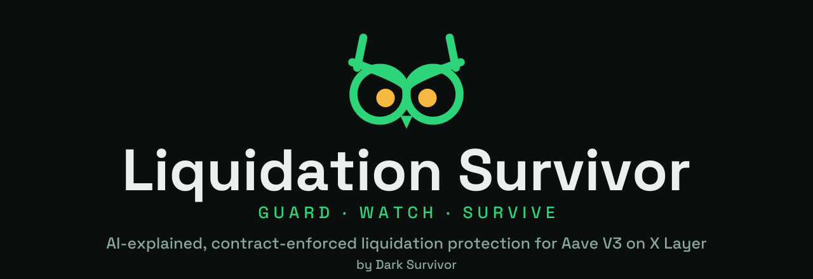

# Liquidation Survivor

**Survive the dip.** AI watches your Aave V3 position on X Layer around the clock, explains your risk in plain
words, and a contract that can only ever repay _your own_ debt steps in before you get liquidated.

_By Dark Survivor · Built on X Layer for the BuildX AI Season._

## Why

$79M is borrowed on Aave V3 on X Layer — two-thirds of the chain's DeFi. Liquidation costs 5–10% of your
collateral. Ethereum users have had DeFi Saver and Summer.fi for years; on X Layer there was nothing — not even
an alert. Liquidation Survivor is that missing layer, with one difference: it talks to you.

## How it works

1. **Connect** your OKX Wallet. We read your Aave position on X Layer.
2. **Understand.** The AI explains it: liquidation prices, how far you are from them, what a 10% drop
   does, and recommends protection parameters (trigger HF, target HF, buffer) with its reasoning.
3. **Enroll.** Two signatures: approve a stablecoin buffer to `SurvivalGuard`, then `enroll(plan)`.
4. **Sleep.** We re-check your health factor every minute and on market events. If it drops below
   your trigger, anyone — our keeper first — can call `protect(you)`. The contract re-reads your health factor
   from Aave **inside the same transaction**, pulls only what's needed from your buffer, and repays your debt.
   You get a Telegram message with the receipt and an explorer link.

Nothing the operator runs can move your funds anywhere except into your own Aave debt. Protection is free:
no fee on repayments, no subscription. No upgradeable contract.

## Repo

| Path         | What                                                                                                                                                                |
| ------------ | ------------------------------------------------------------------------------------------------------------------------------------------------------------------- |
| `contracts/` | `SurvivalGuard.sol`, mocks, Foundry tests and deploy scripts                                                                                                        |
| `src/`       | API, sentinel loop + keeper, Telegram, AI explain/recommend (express, SQLite)                                                                                       |
| `docs/`      | [contracts spec](docs/contracts.md) · [API](docs/api.md) · [architecture](docs/architecture.md) · [references](docs/references.md) |

## Deployments (X Layer)

| Network        | SurvivalGuard                                                                                                                                    | Pool                                                                                                                                                                                                                                                                                 |
| -------------- | ------------------------------------------------------------------------------------------------------------------------------------------------ | ------------------------------------------------------------------------------------------------------------------------------------------------------------------------------------------------------------------------------------------------------------------------------------ |
| Mainnet (196)  | [`0x838Bb12E48cb4Ff40A11BafC8E26855E2C8031B2`](https://web3.okx.com/explorer/x-layer/address/0x838Bb12E48cb4Ff40A11BafC8E26855E2C8031B2)         | Aave V3 `0xE3F3Caefdd7180F884c01E57f65Df979Af84f116`                                                                                                                                                                                                                                 |
| Testnet (1952) | [`0x63AC016d9393dA96b09f35D07cefc1D266015611`](https://web3.okx.com/explorer/x-layer-testnet/address/0x63AC016d9393dA96b09f35D07cefc1D266015611) | `MockPool` [`0x838Bb12E48cb4Ff40A11BafC8E26855E2C8031B2`](https://web3.okx.com/explorer/x-layer-testnet/address/0x838Bb12E48cb4Ff40A11BafC8E26855E2C8031B2) — Aave is mainnet-only on X Layer, so the testnet runs an Aave-shaped mock pool with owner-settable prices to stage dips |

Full address list (mock reserves, keeper): [docs/contracts.md](docs/contracts.md#deployments). The mainnet guard is
exercised by a fork test against the real Aave pool: `pnpm contracts:fork-test`.

## Run

```bash
pnpm install && cp .env.example .env   # fill RPCs, keeper key, Anthropic key, Telegram token
pnpm contracts:test                     # SurvivalGuard unit tests (MockPool)
pnpm dev                                # API + watcher loop on http://localhost:3100
```

The dApp and marketing site are maintained in a separate repository.

## Links

- Site: https://dark-survivor.com
- dApp: https://app.dark-survivor.com
- X: [@DarkSurvivorHQ](https://x.com/DarkSurvivorHQ)
